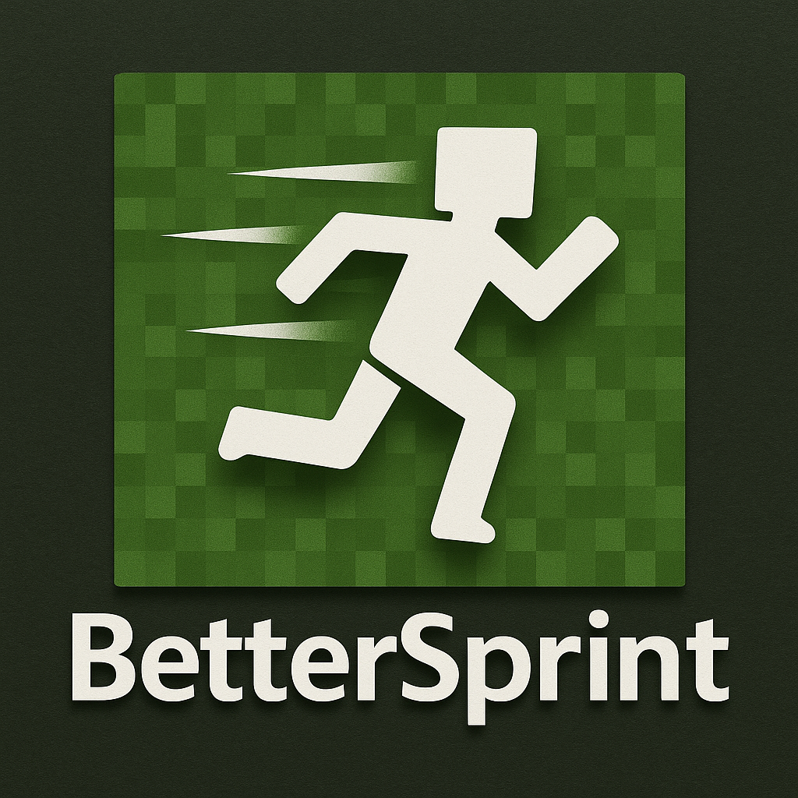

  

BetterSprint improves Minecraft's sprint toggle by showing status in HUD and persistent state across restarts.

## Requirements
- [Fabric](https://fabricmc.net/)
- [Fabric API](https://modrinth.com/mod/fabric-api)
- [Mod Menu](https://modrinth.com/mod/modmenu/versions)
- [YetAnotherConfigLib (YACL)](https://modrinth.com/mod/yacl)

Drop all jars into your `mods` folder alongside BetterSprint, then confirm they appear on the Mods screen before hopping into a world.

## Controls & HUD
- Toggle key: defaults to `G`. Rebind or disable under Options > Controls > Key Binds > Movement > Toggle Sprint (BetterSprint).
- Auto sprinting kicks in whenever the forward key is held while the toggle is on.
- Open the config screen via Mod Menu > BetterSprint > Configure.

## Configuration Options
Every option below is exposed both in Mod Menu and in `config/bettersprint.json5` if you prefer manual edits (close the game first for file edits).

- `showIndicator`: toggle the on-screen sprint status.
- `indicatorX` / `indicatorY`: set horizontal and vertical position.
- `indicatorScale`: adjust indicator size.
- `indicatorShadow`: add a drop shadow for readability.
- `indicatorBackground`: draw a semi-transparent box behind the text.
- `indicatorBorder`: outline the background to make it pop.
- `reduceFovJitter`: fixes FOV jitter camera bug that is present when sprinting&sneaking at the same time.

## Feedback
Found a bug or want a new toggle style? Open an issue at https://github.com/TfourJ/BetterSprint/issues and include your config plus any relevant logs so it is easy to reproduce.
